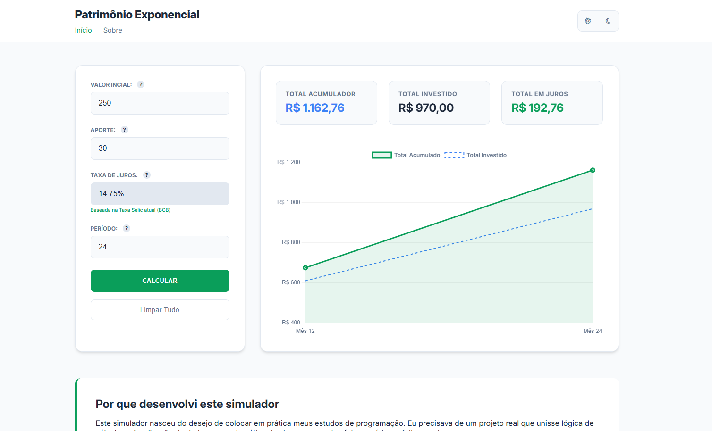
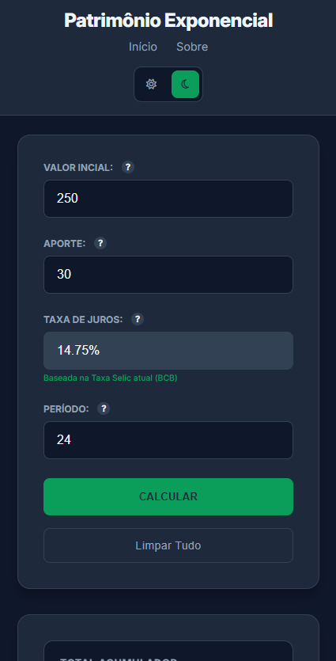

# Patrimônio Exponencial

> Simulador financeiro robusto com dados reais da Taxa Selic, focado em visualização de dados e performance.

<div align="center">
  
  
</div>

Esse simulador foi um projeto que decidi fazer para colocar em prática o que estou estudando de programação. Eu precisava de um projeto real que unisse lógica de cálculo e visualização de dados, e a matemática dos juros compostos foi o cenário perfeito para isso.

O objetivo foi criar algo que fosse além de uma tabela de números frios, entregando uma experiência visual clara para quem está planejando o futuro.

## O que eu usei no projeto

* **JavaScript (Vanilla JS & ES6):** Fiz toda a lógica de cálculo e manipulação de estados sem dependências externas, focando em entender o DOM de verdade.
* **API do Banco Central:** Usei a `Fetch API` para buscar o valor atual da Taxa Selic direto do site do Banco Central.
* **Chart.js:** Biblioteca que utilizei para transformar os números em um gráfico dinâmico e fácil de ler.
* **CSS Grid & Flexbox:** Usei para estruturar o layout e garantir que o site funcione bem no computador e no celular. Também implementei um **Dark Mode** para maior conforto visual.

## Identidade Visual e UI/UX

Desenvolvi o layout focado em um dashboard de finanças moderno, utilizando variáveis CSS para garantir consistência entre os modos claro e escuro.

| Elemento | Light Mode (`#F8FAFC`) | Dark Mode (`#0F172A`) |
| :--- | :--- | :--- |
| **Destaque (Ação)** | `#0A9E5A` | `#087F49` (Hover) |
| **Superfície (Cards)** | `#FFFFFF` | `#1E293B` |
| **Texto Principal** | `#1E293B` | `#F1F5F9` |
| **Texto Secundário** | `#64748B` | `#94A3B8` |
| **Bordas/Linhas** | `#E2E8F0` | `#334155` |

### Diferenciais de Interface:
- **Tipografia Inter:** Escolhida pela alta legibilidade em dados numéricos.
- **Feedback Humanizado:** Mensagens de erro específicas que orientam o usuário em vez de apenas "bloquear" a ação.
- **Persistência de Estado:** O sistema garante que dados oficiais (como a Selic) não sejam perdidos durante o reset do formulário.

## Desafios Técnicos

Essa foi a parte mais importante do meu aprendizado neste projeto:

1.  **Integração do Chart.js:** O maior desafio técnico foi integrar o gráfico de forma nativa. Como não utilizei um compilador (como o Vite), tive erros de importação e precisei lidar com a biblioteca via URL (CDN), garantindo a compatibilidade dos módulos.
2.  **Refatoração do Layout:** No início, a estrutura dos cards não estava se comportando bem. Percebi que o layout estava "quebrando" em algumas telas, então parei tudo e reconstruí a Grid do zero para deixá-lo realmente responsivo.
3.  **Tratamento de Erros na API:** Aprendi que não basta dar um `fetch`. Implementei a verificação de `response.ok` e uma "taxa de segurança" (fallback) para o simulador não travar caso a API do Banco Central fique fora do ar.
4.  **Código Limpo:** Durante o processo, notei que tinha muitas funções repetidas. Refatorei o código para eliminar duplicidades e deixar a lógica mais organizada.

## Como executar o projeto

1.  **Clone este repositório:**
    ```bash
    git clone [https://github.com/Felipe-C-Gonzalez/patrimonio-exponencial.git](https://github.com/Felipe-C-Gonzalez/patrimonio-exponencial.git)
    ```
2.  **Acesse a pasta do projeto:**
    ```bash
    cd patrimonio-exponencial
    ```
3.  **Execute o index.html:**
    Abra o arquivo diretamente no navegador ou utilize a extensão **Live Server** no VS Code para uma melhor experiência.

---

## Desenvolvido por

**Felipe C. Gonzalez**
* [LinkedIn](https://linkedin.com/in/felipecgonzalez)
* [GitHub](https://github.com/Felipe-C-Gonzalez)

---
*Projeto desenvolvido para fins de estudo e prática de desenvolvimento Frontend.*